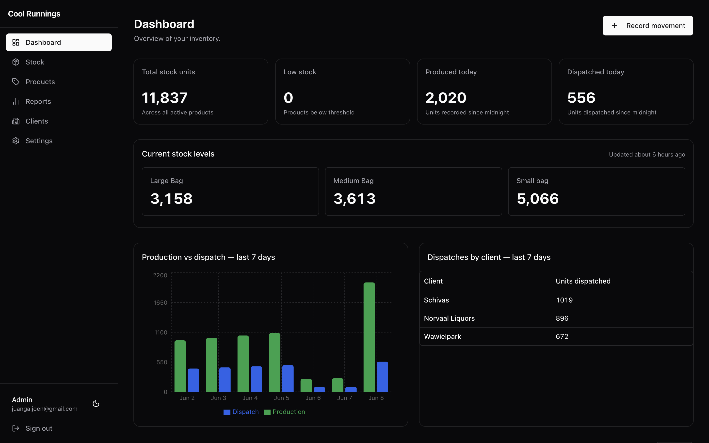

# Ice Inventory Management System

A production web application built for a small ice-manufacturing business to replace
manual, spreadsheet-based stock tracking. Staff record production, dispatches, and
adjustments from any device; the system keeps a running, tamper-resistant view of stock
on hand and a full audit trail of every movement.

Built and deployed as a freelance project. This is a sanitised public copy for portfolio
purposes — the client runs a separate private deployment.

> **Stack:** Next.js 14 (App Router) · TypeScript · Supabase (Postgres) · Tailwind CSS · shadcn/ui

---

## Why it's interesting

This isn't a CRUD demo — the design pushes correctness and access control into the
database so the rules hold even if the UI is bypassed:

- **Role-based access control** for three roles (admin / staff / rep), enforced in three
  layers: route protection, server-action guards, and Postgres Row Level Security.
- **Append-only audit log.** Every stock change is an immutable `stock_movements` row.
  Live stock levels are derived, never edited directly.
- **Database-enforced integrity.** A Postgres trigger applies each movement to stock
  levels, and a `CHECK (quantity >= 0)` constraint makes overselling impossible —
  race-safe, rather than relying on an app-level pre-check.
- **Privilege-escalation guard.** A trigger blocks users from changing their own role,
  closing the gap left by row-level (not column-level) RLS.
- **Defense-in-depth for sensitive data.** Pricing and commission figures are admin-only,
  enforced via column allowlists in queries, role-branched server actions, and conditional
  UI — never `SELECT *` to a non-admin.

## Features

**All authenticated users**
- Dashboard with current stock levels, low-stock and out-of-stock highlighting, and recent movements
- Record production, dispatch, and adjustment movements (staff/admin)
- Date-range reports with CSV export
- Mobile-responsive UI with a collapsible sidebar

**Admins additionally**
- Product catalogue management, including ZAR pricing
- User management: invite users, assign roles, assign reps to clients, set commission rates
- Revenue and commission reporting

**Reps**
- Read-only access plus a "My commission" card summarising units dispatched to their assigned clients

## Tech stack

| Layer              | Choice                                        |
| ------------------ | --------------------------------------------- |
| Framework          | Next.js 14 (App Router), TypeScript           |
| UI                 | Tailwind CSS, shadcn/ui, recharts             |
| Forms / validation | react-hook-form + zod                         |
| Database & Auth    | Supabase (Postgres, Auth via `@supabase/ssr`) |
| Hosting            | Vercel (app) + Supabase (database)            |

## Architecture

- **Server actions** for every database write — co-located with their route as `actions.ts`
  and wrapped with shared `protectedAction` / `adminAction` helpers that enforce auth and
  role checks consistently, with zod validation on input.
- **Supabase RLS** on every table: authenticated users can read; only admins can write to
  products and profiles; `stock_levels` is never written directly (trigger-only).
- **Schema as migrations.** All schema lives in versioned SQL migrations under
  `supabase/migrations` — no dashboard-driven schema changes.

```
app/
  login/                 Public auth page
  dashboard/             Protected app (stock, products, clients, reports, settings)
components/              Shared UI
lib/
  supabase/              Supabase clients (browser, server, admin, middleware)
  schemas/               Shared zod schemas
  auth-helpers.ts        protectedAction / adminAction / validate wrappers
supabase/migrations/     Versioned schema
types/                   Shared TypeScript types
```

## Getting started

**Prerequisites:** Node 18+, a Supabase project, the Supabase CLI.

```bash
# 1. Install dependencies
npm install

# 2. Configure environment
cp .env.local.example .env.local
#    then fill in your Supabase project URL and keys

# 3. Apply the database schema
supabase db push

# 4. Run the dev server
npm run dev
```

Open http://localhost:3000.

Required environment variables (see `.env.local.example`):

| Variable                        | Purpose                                                |
| ------------------------------- | ------------------------------------------------------ |
| `NEXT_PUBLIC_SUPABASE_URL`      | Supabase project URL                                   |
| `NEXT_PUBLIC_SUPABASE_ANON_KEY` | Public anon key (browser/server clients)               |
| `SUPABASE_SERVICE_ROLE_KEY`     | Service role key (admin operations only — server-side) |

## Scripts

```bash
npm run dev         # start the dev server
npm run build       # production build
npm run lint        # next lint
npm run typecheck   # tsc --noEmit
```

## Screenshots


